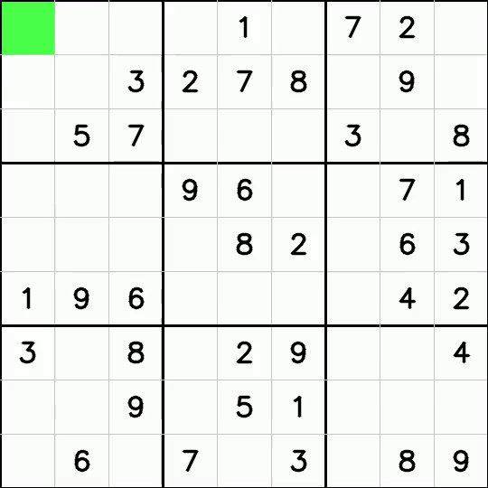

# Sudoku Solver

A Python implementation of Sudoku solvers with video visualization.

## Standard Naive Backtracking


## Max-Conflict Heuristic


## Requirements

- Python 3.x
- OpenCV
- NumPy

```bash
pip install opencv-python numpy
```

## Usage

Run either solver:

```bash
python backtracking.py
```

or

```bash
python max-conflict-backtracking.py
```

## Algorithms

| Algorithm | Description |
|-----------|-------------|
| Backtracking | Tries numbers 1-9 in empty cells sequentially |
| Max-Conflict | Picks the empty cell with the most constrained neighbors first (MRV heuristic) |